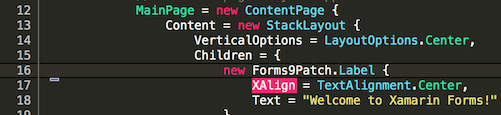
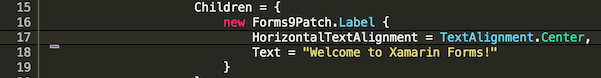
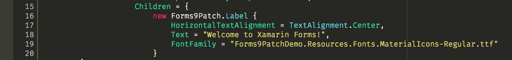

# Using Embedded Resource Custom Fonts

Forms9Patch's label and button elements have built in support for using Embedded Resource custom fonts - a much simpler approach to custom fonts.  Likewise, Forms9Patch provides the `Forms9Patch.EmbeddedResourceFontEffect` effect to make using Embedded Resource custom fonts easier for all Xamarin.Forms elements that have the `FontFamily` property.

## Adding your custom font as an Embedded Resource

Below is an example of how to use Forms9Patch's custom font management.  The example uses Google's [Material Design Icons font](https://github.com/google/material-design-icons/blob/master/iconfont/MaterialIcons-Regular.ttf), which they have been nice enough to license under the [Creative Common Attribution 4.0 International License (CC-BY 4.0)](http://creativecommons.org/licenses/by/4.0/)!

1. Follow one of the below **Getting Started** guides to create a **.NetStandard** Xamarin Forms cross-platform app with the `MyDemoApp` assembly namespace.  

    - [Getting Started: VisualStudio 2017 for Mac](GettingStartedMac.md)
    - [Getting Started: VisualStudio 2017 for Windows](GettingStartedWindows.md)

2. Create a **Resources** folder in the app's shared code (.NetStandard) project:

    - Right click on your .NetStandard project and select **Add / New Folder**.

      

    - A **New Folder** folder should appear.  Rename it **Resources**.

      | Before | After |
      |--------|-------|
      | |  |

3. Create a **Fonts** folder under the **Resources** folder in the app's shared code (.NetStandard) project

    

4. Save the **MaterialIcons-Regular.ttf** custom font file to the **Resources/Fonts** folder.  I prefer to drag it from OSX Finder or Windows File Explorer into the **Resources/Fonts** folder in VisualStudio.

    

5. Set the **Build Action** to **EmbeddedResource** for this custom font.

    

6. Make note of the Resource ID of this custom font.  See [Embedded Resource Id Naming Convention](ImageSource.md#embedded-resource-id-naming-convention) for details.

Your Embedded Resource custom font is now ready for use by Forms9Patch label and button elements and for any Xamarin.Forms.VisualElement that supports the `FontFamily` property.

## Embedded Resource custom font with Forms9Patch Label

This section assumes you've added your custom font to your Shared Code project, as described in [Adding your custom font as an Embedded Resource](#adding-your-custom-font-as-an-embedded-resource), above.

1. Open your shared source (.NetStandard) application source file (**MyDemoApp.cs** in this example)

2. Change the Label element to a Forms9Patch Label:

    

    Note: The `XAlign` and `YAlign` properties have long ago been deprecated by Xamarin.  As such, I didn't implement them in Forms9Patch.  Use `HorizontalTextAlignment` and `VerticalTextAlignment` instead.

    

3. Set the FontFamily property to the font's EmbeddedResource ID

    

    If you compile and run now, you should see some very unexpected output.  Why? Because the Material Icons doesn't have support for most standard characters!

    

4. Because we're using Material Icons (which is great for symbols but terrible for text), we are going to need to non-latin, unicode characters to our string.  With Forms9Patch, we have some options for specifying unicode characters.  Here are three approaches to getting the label in this example to display the following Material-Icon characters:

    

    **Copy and Paste**

    A lot of times, you can get a Unicode character by copying it from a web page or from an application (like FontBook on OSX).  Once you copy it, you can then paste it into your string in Visual Studio or Xamarin Studio.  For your convenience, here [    ] (between the brackets) are the unicode characters for the Material Icons Font's scissors, airplane, and umbrella characters.  When you copy them and paste into a string in VisualStudio, they will appear as shown below.  If you use that string as the text for Forms9Patch.Label using the MaterialIcons-Regular.ttf font, it will render as shown, above.

    

    **C# unicode escape code**

    C# makes unicode pretty easy via escape codes ... as long as the character is 16 bit!  For the Material Icons font, you can go [here](https://design.google.com/icons), select the character (icon in this case) you want.  Then, at the bottom right of the page, select **< > ICON FONT**.  There you can find the hexadecimal escape code (see "For IE9 and below").  For the scissors, it is `&#xE14E;`.  For the airplane, is be `&#xE195;`.  And for the umbrella, it is `&#xEB3E;`.  Since each has 4 hexadecimal characters, they all are 16 bit unicode - and I get to avoid explaining how to deal with 32 bit unicode.  In our example, replace `"Welcome to Xamarin Forms"` with `"\uE14E \uE195 \uEB3E"`.  Notice, for each escape code, that the leading `&#` was replaced with `\u` and the trailing semicolon was dropped.

    

    **HtmlText property**

    By design, HTML does a great job with Unicode.  The `HtmlLabel` property wouldn't be useful without that magic.  For this example, remember (above) that the HTML escape codes we found on Google's Material Design Icons page were (Scissors=`&#xE14E;`.  Airplane=`&#xE195;`.  Umbrella=`&#xEB3E;`. ).  Since these are HTML escape codes, we can pass them in a string to the `HtmlText` property.

    

## Embedded Resource custom fonts with Xamarin Forms text elements and EmbeddedResourceFontEffect

This section assumes you've added your custom font to your Shared Code project, as described in [Adding your custom font as an Embedded Resource](#adding-your-custom-font-as-an-embedded-resource), above.

1. Open your shared source (.NetStandard) application source file (**MyDemoApp.cs** in this example)

2. Using an existing `Xamarin.Forms.Label` element or create a new one.

3. Set the FontFamily property to the font's EmbeddedResource ID.

   

4. Add the `EmbeddedResourceFontEffect` to your Xamarin.Forms text elements.  Shown above are two different approaches to this.