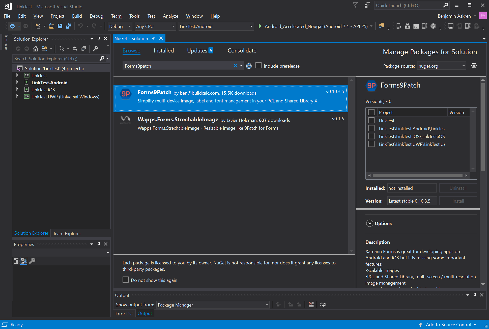

# Getting Started: VisualStudio 2017

Forms9Patch is meant to make it easier to enhance your Xamarin.Forms app. Below is a guide to how to get started.

Before you begin, check out the system requirements to be sure your application and development environment is ready.

## System Requirements

Forms9Patch is an enhancement to Xamarin.Forms.  As such, first be sure you've met the [Xamarin.Forms system requirements](https://developer.xamarin.com/guides/cross-platform/getting_started/requirements/).  

Additionally:
 - Forms9Patch requires Xamarin.Forms version 2.4.0.280 or newer. 
 - To use the <i>`background-color`</i> style attribute within markup text in UWP applications, your UWP applications will need to be built with minimum Windows version of 10.0.16299.0 (Windows 10 Fall Creators Update).


## Build your first Forms9Patch app

This walk through demonstrates how to create an application that displays a label which is marked-up to show a phone number and email link.  Tapping on those links will present a pop-up that asks permission to proceed with the phone call or email.

Create the LinkTest application as follows:

 1. Launch VisualStudio.  
 2. Create a new Xamarin Forms project by clicking File / New / Project menu item.
 3. In the New Project dialog, click Cross-Platform, select the Cross Platform App (Xamarin.Forms or Native) template, set the Name and Solution name to `LinkTest`, choose a suitable location for the project and click the OK button:

    

 4. In the New Cross Platform App dialog, click "Blank App", select "Xamarin.Forms" as the UI Technology, select Portable Class Library (PCL) as the Code Sharing Strategy, and click the OK button:

    

 5. Add the Forms9Patch Nuget package to each of your solution's projects:  

    1. In Solution Explorer, right-click on the LinkTest solution and select Manage NuGet Packages for Solution...:

        

    2. ... select the Browse tab ...:
    
     

    3. ... and search for "Forms9Patch":

        

    4. Select the Forms9Patch Nuget package:

        

    5. Apply it to all of your solution's projects by selecting the check box at the top of the project selection column:

        

    6. Be sure the latest stable package is selected and then click [Install]:

        

 6. Initialize Forms9Patch in each of your platform projects:

    **Android:** 

    1. Open MainActivity.cs in your solution's Android platform project.
    2. Between ```global::Xamarin.Forms.Forms.Init(this, bundle);``` and ```LoadApplication(new App());```, add the Forms9Patch.Droid initialization call using the key for the LinkTest applications.  The result should look the following:

        ```csharp
            global::Xamarin.Forms.Forms.Init(this, bundle);
            Forms9Patch.Droid.Settings.Initialize(this, "9H8X-28X4-5N8S-8CWB-8YFT-JK6D-TRAP-E9R6-WYPV-9KUS-2DM9-E4T2-XVAR");
            LoadApplication(new App());
        ```

    **iOS**

    1. Open AppDelegate.cs in your solution's iOS platform project.
    2. Between ```global::Xamarin.Forms.Forms.Init();``` and ```LoadApplication(new App());```, add the Forms9Patch.iOS initialization call using the key for the LinkTest applications.  The result should look like the following:

        ```csharp
            global::Xamarin.Forms.Forms.Init();
            Forms9Patch.iOS.Settings.Initialize(this, "9H8X-28X4-5N8S-8CWB-8YFT-JK6D-TRAP-E9R6-WYPV-9KUS-2DM9-E4T2-XVAR");
            LoadApplication(new App());
        ```

    3. Open the iOS platform project's Info.plist and verify the "Application Name" is set to "LinkTest".

    **UWP**

    1. Add the Forms9Patch initialization:
        1. Open App.xaml.cs in your solution's UWP platform project.
        2. Find the following line

            ```csharp
                 Xamarin.Forms.Forms.Init(e);
            ```

        3. ... and **replace** it with the following lines:

            ```csharp
                    Xamarin.Forms.Forms.Init(e, Forms9Patch.UWP.Settings.AssembliesToInclude); 
                    Forms9Patch.UWP.Settings.Initialize(this, "9H8X-28X4-5N8S-8CWB-8YFT-JK6D-TRAP-E9R6-WYPV-9KUS-2DM9-E4T2-XVAR");
            ```
    4. Set the UWP application's name to match the Forms9Patch license:
        1. Open Package.appxmanifest in your solution's UWP platform project.
        2. In the Application tab, be sure the "Display Name:" is set to ```LinkTest```.
        3. In the Packaging tab, be sure the "Package Display Name:" is set to ```LinkTest```.

 7. Update your application's MainPage content to use Forms9Patch elements:
     1. In Solution Explorer, in the LinkTest project, double-click MainPage.xaml to open it:
     2. In MainPage.xaml, remove all of the template code and replace it with the following code. This code declaratively defines the user interface for the page:

        ```xml
        <?xml version="1.0" encoding="UTF-8"?>
        <ContentPage xmlns="http://xamarin.com/schemas/2014/forms"
                           xmlns:x="http://schemas.microsoft.com/winfx/2009/xaml"
                           xmlns:Forms9Patch="clr-namespace:Forms9Patch;assembly=Forms9Patch"
                           x:Class="LinkTest.MainPage">
            <ContentPage.Padding>
                <OnPlatform x:TypeArguments="Thickness">
                    <On Platform="iOS" Value="20, 40, 20, 20" />
                    <On Platform="Android, WinPhone, Windows" Value="20" />
                </OnPlatform>
            </ContentPage.Padding>
            <StackLayout>
              <Forms9Patch:Label Text="Enter a Phoneword:" />
              <Entry x:Name="phoneNumberText" Text="1-855-XAMARIN" />
              <Button x:Name="translateButon" Text="Translate" Clicked="OnTranslate" />
              <Button x:Name="callButton" Text="Call" IsEnabled="false" Clicked="OnCall" />
            </StackLayout>
        </ContentPage>
        ```


