# Getting Started: VisualStudio 2017 for Mac

Before you begin, check out the [system requirements](../notes/SystemRequirements.md) to be sure your application and development environment is ready.

This walk through demonstrates how to create an application that displays a label which is marked-up to show a phone number and email link.  Tapping on those links will present a pop-up that asks permission to proceed with the phone call or email.

Create the LinkTest application as follows:

1. Launch VisualStudio.

2. Create a new Xamarin Forms project by clicking **File | New Solution** menu item.  The **New Project** dialog will appear.

    

3. Select **Multiplatform | App** in the left navigation pad.  Select **Xamarin.Forms | Blank Forms App** from the list of templates.  Click **[Next]**.  The second **New Project** dialog will appear.

    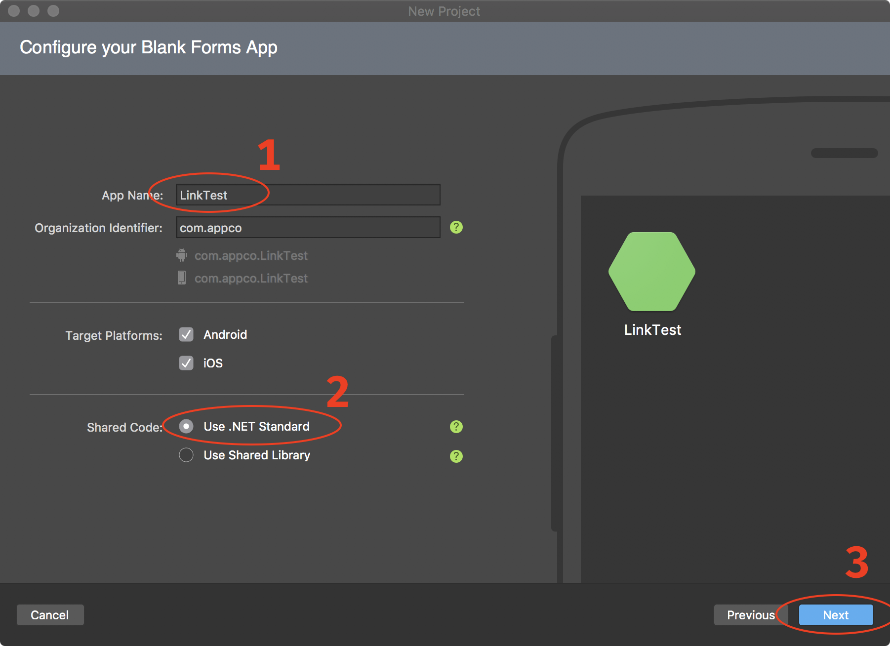

4. Enter `LinkTest` for the **App Name:**, select **Use .NET Standard** for the **Shared Code:**, and click **[Next]**.  The third **New Project** dialog will appear.

    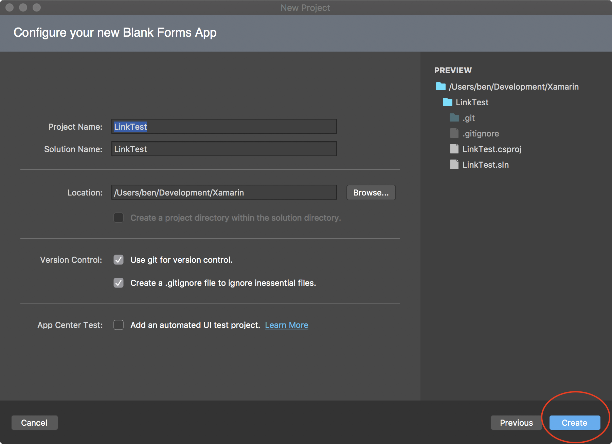

5. Your project settings should be as above.  Click **[Create]** to start the project creation process.  When complete, you will have a new project with the `MainPage.xaml` file open.

    

6. Add the Forms9Patch NuGet package to each of the solution's projects:

   ### Shared Code Project

   - Expand the **Dependencies** folder in the **LinkTest** project.

      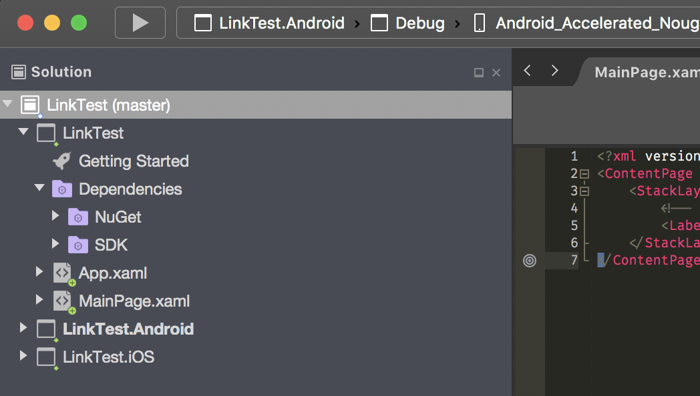

   - Right click on the **NuGet** folder.  The options pop-up menu will appear.

      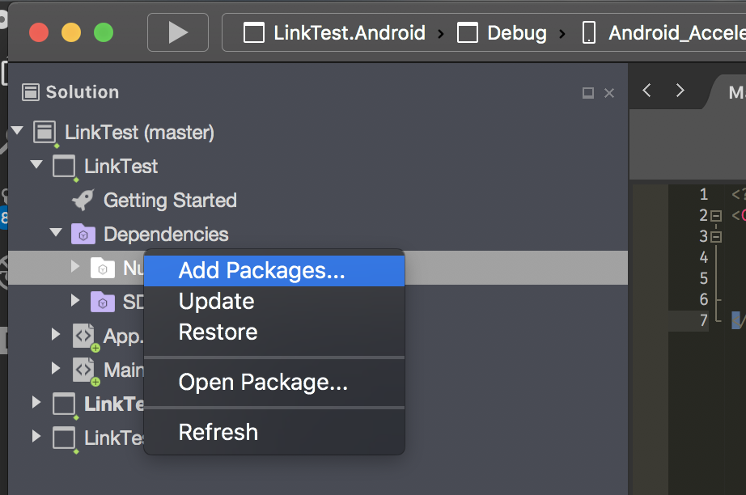

   - Select **Add Packages...**.  The **Add Packages** dialog will appear.

      

   - Enter `Forms9Patch` into the search box (top right).  When the **Forms9Patch** package appears, select it and then click **[Add Package]** to add it to the **LinkTest** project.

   ### Android Platform Project

   - Expand the **LinkTest.Droid** project.

      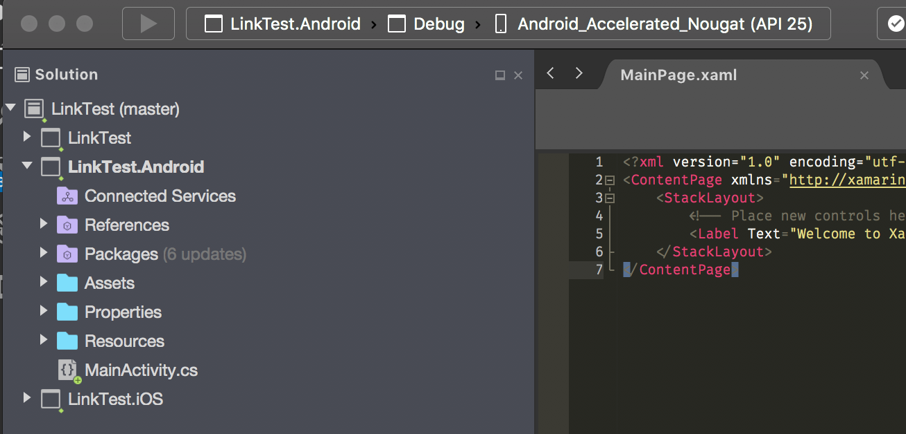

   - Double click on the **Packages** folder to open the **Add Packages** dialog.

      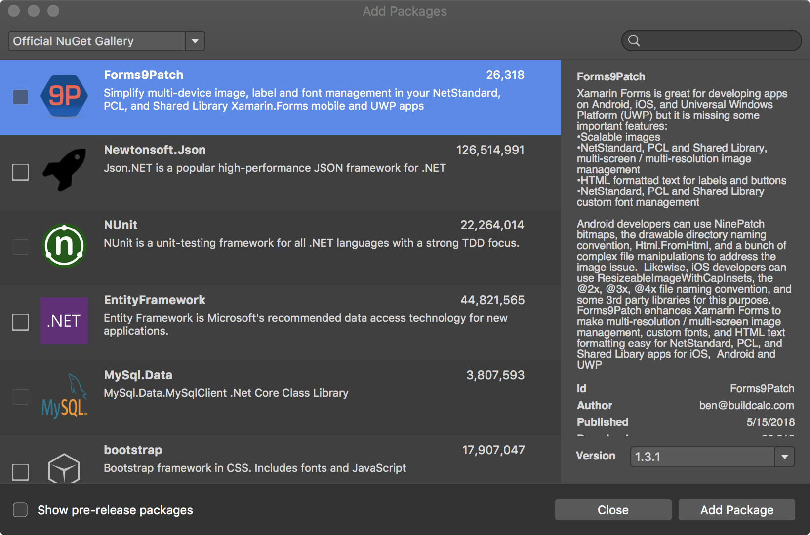

   - If you just completed the **Shared Code Project** instructions, above, then **Forms9Patch** will be shown as the first package (as shown in the above image).  Otherwise, enter `Forms9Patch` into the search box (top right).  When the **Forms9Patch** package appears, select it and then click **[Add Package]** to add it to the **LinkTest** project.

   ### iOS Platform Project

   - Expand the **LinkTest.iOS** project.

      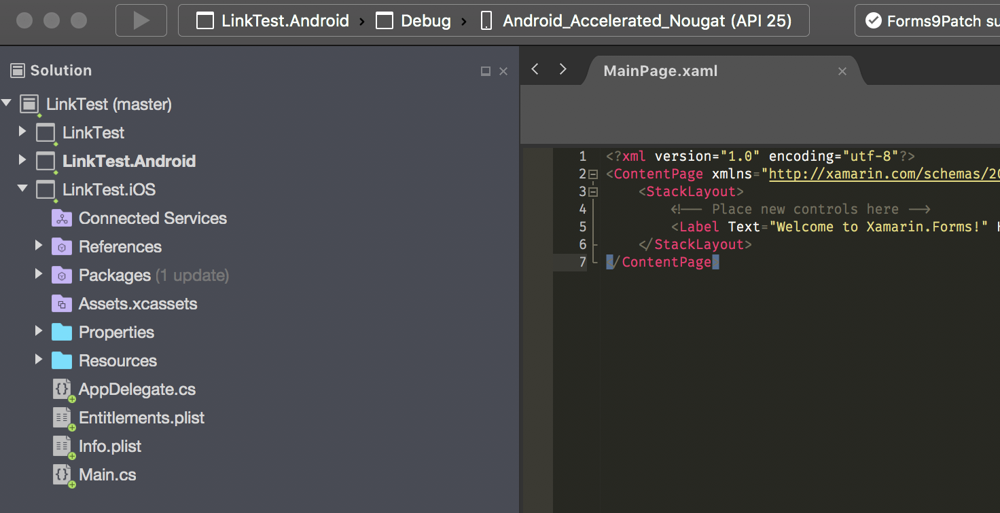

   - Double click on the **Packages** folder to open the **Add Packages** dialog.

      

   - If you just completed the **Shared Code Project** instructions, above, then **Forms9Patch** will be shown as the first package (as shown in the above image).  Otherwise, enter `Forms9Patch` into the search box (top right).  When the **Forms9Patch** package appears, select it and then click **[Add Package]** to add it to the **LinkTest** project.

7. Initialize Forms9Patch in each of your platform projects:

    ### Android:

    1. Open MainActivity.cs in your solution's Android platform project.
    2. Between ```global::Xamarin.Forms.Forms.Init(this, bundle);``` and ```LoadApplication(new App());```, add the Forms9Patch.Droid initialization call using the key for the LinkTest applications.  The result should look like the following:

        ```csharp
            global::Xamarin.Forms.Forms.Init(this, bundle);
            Forms9Patch.Droid.Settings.Initialize(this);
            LoadApplication(new App());
        ```

    ### iOS:

    1. Open AppDelegate.cs in your solution's iOS platform project.
    2. Between ```global::Xamarin.Forms.Forms.Init();``` and ```LoadApplication(new App());```, add the Forms9Patch.iOS initialization call using the key for the LinkTest applications.  The result should look like the following:

        ```csharp
            global::Xamarin.Forms.Forms.Init();
            Forms9Patch.iOS.Settings.Initialize(this);
            LoadApplication(new App());
        ```
8. Update your application's MainPage content (MainPage.xaml) to use Forms9Patch elements:
     1. In Solution Explorer, in the LinkTest project, double-click MainPage.xaml to open it.
     2. Update MainPage.xaml with the following code. This code declaratively defines the user interface for the page.

        ```xml
        <?xml version="1.0" encoding="utf-8" ?>
        <ContentPage xmlns="http://xamarin.com/schemas/2014/forms"
                    xmlns:x="http://schemas.microsoft.com/winfx/2009/xaml"
                            xmlns:Forms9Patch="clr-namespace:Forms9Patch;assembly=Forms9Patch"
                    xmlns:local="clr-namespace:LinkTest"
                    x:Class="LinkTest.MainPage">
            <ContentPage.Padding>
                <OnPlatform x:TypeArguments="Thickness">
                    <On Platform="iOS" Value="20, 40, 20, 20" />
                    <On Platform="Android, WinPhone, Windows" Value="20" />
                </OnPlatform>
            </ContentPage.Padding>
            <StackLayout VerticalOptions="Center">
                <Forms9Patch:Label HorizontalTextAlignment="Center">
                    Example of Forms9Patch markup text.
                </Forms9Patch:Label>
                <BoxView HeightRequest="1" Color="Black"></BoxView>
                <Forms9Patch:Label x:Name="PhoneLabel"  HorizontalTextAlignment="Center" TextColor="Black">
                    <![CDATA[This is a phone number link: <a id="link1" href="tel:+353015546889">015546889</a> ]]>
                </Forms9Patch:Label>
                <BoxView HeightRequest="1" Color="Black"></BoxView>
                <Forms9Patch:Label x:Name="EmailLabel" HorizontalTextAlignment="Center" TextColor="Black">
                    <![CDATA[This is an email link: <a id="link2" href="mailto:email@hotmail.com">email@hotmail.com</a> ]]>
                </Forms9Patch:Label>
            </StackLayout>
        </ContentPage>
        ```

9. Modify your share code's MainPage source code (`MainPage.xaml.cs`) using the following code so it will respond to clicks / taps on the `Forms9Patch.Label` action links.

    ```csharp
    using System;
    using System.Collections.Generic;
    using System.Linq;
    using System.Text;
    using System.Threading.Tasks;

    using Xamarin.Forms;
    using Xamarin.Forms.Xaml;

    namespace LinkTest
    {
        public partial class MainPage : ContentPage
        {
            public MainPage()
            {
                InitializeComponent();
                PhoneLabel.ActionTagTapped += ActionTagTapped;
                EmailLabel.ActionTagTapped += ActionTagTapped;
            }

            private void ActionTagTapped(object sender, Forms9Patch.ActionTagEventArgs e)
            {
                Forms9Patch.Toast.Create("Link Activated", "The link (id: " + e.Id + ", href:" + e.Href + ") was activated.");
            }
        }
    }
    ```
    
10. Now, you're ready to build and run the LinkTest app on a platform.  Since you're developing this app on a Mac, how about running LinkTest.iOS?

    - Go to the Startup Project Selection drop down and select the `LinkTest.iOS` project

        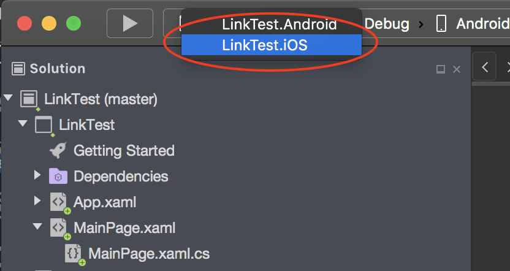

    - Click the **[▶]** button to start the build-run process

    - After the build is complete, the iOS Simulator will start and VisualStudio will deploy the app's package.

    - Click on any of the links and you should see something like the following:

        || 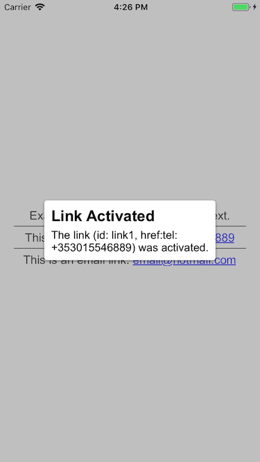  |  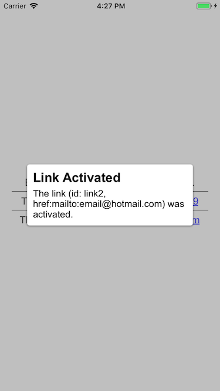 |
        |:-:|:-:|:-:|

11. Try changing the Startup Project to `TestLink.Android` and run it on an x86 based Android emulator.  

    - As mentioned earlier: because of Forms9Patch's more comprehensive `Forms9Patch.Clipboard` functionality, you will have to add the following code to your Android project's `Resources/Values/string.xml` file,before you can build your Android project.  

        ```xml
        <string>name="forms9patch_copy_paste_authority">your_Android_app_package_name_here.f9pcopypaste</string>
        ```

        I know - it's a pain.  At some point of time, I'll have to see if I can use some of the trickery used by the Xamarin.Facebook Nuget Package to get rid of this requirement.

    - BE SURE YOU DON'T RUN IT ON AN **ARM** BASED EMULATOR.

    |   |   |  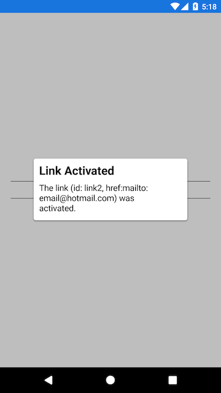 |
    |:-:|:-:|:-:|
