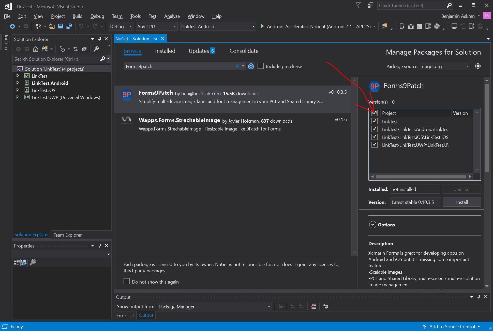
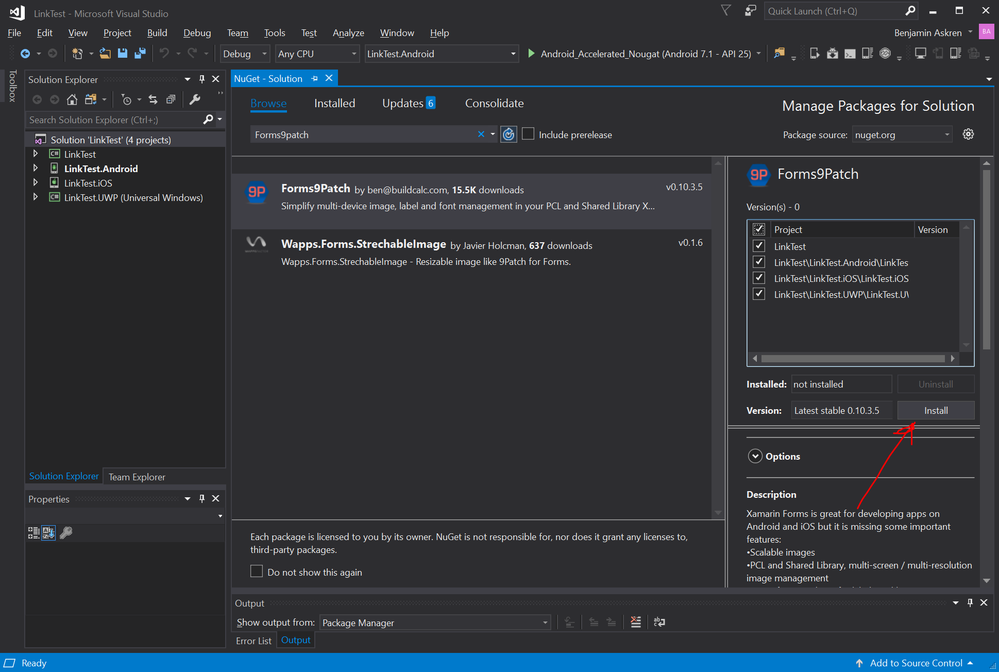

# Getting Started: VisualStudio 2017 for Windows

Before you begin, check out the [system requirements](../notes/SystemRequirements.md) to be sure your application and development environment is ready.

This walk through demonstrates how to create an application that displays a label which is marked-up to show a phone number and email link.  Tapping on those links will present a pop-up that asks permission to proceed with the phone call or email.

Create the LinkTest application as follows:

 1. Launch VisualStudio.
 2. Create a new Xamarin Forms project by clicking **File | New | Project** menu item.
 3. In the New Project dialog, browse to **Installed | Visual C# | Cross-Platform**, select the **Mobile App (Xamarin.Forms)** template, set the Name and Solution name to `LinkTest`, assure a suitable location for the project and click the **[OK]** button:

    

 4. In the New Cross Platform App dialog, select the **Blank App** template, select **.Net Standard** Code Sharing Strategy, and then click the **[OK]** button:

    

 5. Add the Forms9Patch NuGet package to each of your solution's projects:  

    - In Solution Explorer, right-click on the LinkTest solution and select Manage NuGet Packages for Solution...:

      

    - ... select the Browse tab ...:

      

    - ... and search for "Forms9Patch":

      

    - Select the Forms9Patch Nuget package:

      

    - Apply it to all of your solution's projects by selecting the check box at the top of the project selection column:

      

    - Be sure the latest stable package is selected and then click [Install]:

      

 6. Initialize Forms9Patch in each of your platform projects:

    ### Android

    1. Open MainActivity.cs in your solution's Android platform project.
    2. Between ```global::Xamarin.Forms.Forms.Init(this, bundle);``` and ```LoadApplication(new App());```, add the Forms9Patch.Droid initialization call using the key for the LinkTest applications.  The result should look like the following:

        ```csharp
            global::Xamarin.Forms.Forms.Init(this, bundle);
            Forms9Patch.Droid.Settings.Initialize(this);
            LoadApplication(new App());
        ```

    ### iOS

    1. Open AppDelegate.cs in your solution's iOS platform project.
    2. Between ```global::Xamarin.Forms.Forms.Init();``` and ```LoadApplication(new App());```, add the Forms9Patch.iOS initialization call using the key for the LinkTest applications.  The result should look like the following:

        ```csharp
            global::Xamarin.Forms.Forms.Init();
            Forms9Patch.iOS.Settings.Initialize(this);
            LoadApplication(new App());
        ```

    ### UWP

    1. Open App.xaml.cs in your solution's UWP platform project.
    2. Find the following line

        ```csharp
                Xamarin.Forms.Forms.Init(e);
        ```

    3. ... and **replace** it with the following lines:

        ```csharp
                Xamarin.Forms.Forms.Init(e, Forms9Patch.UWP.Settings.AssembliesToInclude);
                Forms9Patch.UWP.Settings.Initialize(this);
        ```

 7. Update your application's MainPage content (MainPage.xaml) to use Forms9Patch elements:
     1. In Solution Explorer, in the LinkTest shared .NetStandard project (*not* the LinkTest.UWP platform project), double-click MainPage.xaml to open it.
     2. Update MainPage.xaml with the following changes. This code declaratively defines the user interface for the page.

        ```xml
        <?xml version="1.0" encoding="utf-8" ?>
        <ContentPage xmlns="http://xamarin.com/schemas/2014/forms"
                    xmlns:x="http://schemas.microsoft.com/winfx/2009/xaml"
                    xmlns:Forms9Patch="clr-namespace:Forms9Patch;assembly=Forms9Patch"
                    xmlns:local="clr-namespace:LinkTest"
                    x:Class="LinkTest.MainPage">
            <ContentPage.Padding>
                <OnPlatform x:TypeArguments="Thickness">
                    <On Platform="iOS" Value="20, 40, 20, 20" />
                    <On Platform="Android, WinPhone, Windows" Value="20" />
                </OnPlatform>
            </ContentPage.Padding>
            <StackLayout VerticalOptions="Center">
                <Forms9Patch:Label HorizontalTextAlignment="Center">
                    Example of Forms9Patch markup text.
                </Forms9Patch:Label>
                <BoxView HeightRequest="1" Color="Black"></BoxView>
                <Forms9Patch:Label x:Name="PhoneLabel"  HorizontalTextAlignment="Center" TextColor="Black">
                    <![CDATA[This is a phone number link: <a id="link1" href="tel:+353015546889">015546889</a> ]]>
                </Forms9Patch:Label>
                <BoxView HeightRequest="1" Color="Black"></BoxView>
                <Forms9Patch:Label x:Name="EmailLabel" HorizontalTextAlignment="Center" TextColor="Black">
                    <![CDATA[This is an email link: <a id="link2" href="mailto:email@hotmail.com">email@hotmail.com</a> ]]>
                </Forms9Patch:Label>
            </StackLayout>
        </ContentPage>
        ```

 8. Modify your application's MainPage source code (MainPage.xaml.cs) using the following code so it will respond to clicks / taps on the `Forms9Patch.Label` action links.

    ```csharp
    using System;
    using System.Collections.Generic;
    using System.Linq;
    using System.Text;
    using System.Threading.Tasks;

    using Xamarin.Forms;
    using Xamarin.Forms.Xaml;

    namespace LinkTest
    {
        //[XamlCompilation(XamlCompilationOptions.Compile)]
        public partial class MainPage : ContentPage
        {
            public MainPage()
            {
                InitializeComponent();
                PhoneLabel.ActionTagTapped += ActionTagTapped;
                EmailLabel.ActionTagTapped += ActionTagTapped;
            }

            private void ActionTagTapped(object sender, Forms9Patch.ActionTagEventArgs e)
            {
                Forms9Patch.Toast.Create("Link Activated", "The link (id: " + e.Id + ", href:" + e.Href + ") was activated.");
            }
        }
    }
    ```
 
 9. Now, you're ready to build and run the LinkTest app on a platform.  Since you're developing this app on Windows, how about running LinkTest.UWP?

     - Go to the Startup Project Selection drop down and sel ect the `LinkTest.UWP (Universal Windows)` project

        

     - Click the **[> LocalMachine]** button to start the build-run process

     - After the build is complete, the package will deploy to Windows and you will see the following application:

        

     - Click on any of the links and you should see something like the following:

        

 10. Try changing the Startup Project to `TestLink.Android` and run it on an x86 based Android emulator.  

     - Because of Forms9Patch's more comprehensive `Forms9Patch.Clipboard` functionality, you will have to add the following code to your Android project's `Resources/Values/string.xml` file,before you can build your Android project.  

        ```xml
        <string name="forms9patch_copy_paste_authority">your_Android_app_package_name_here.f9pcopypaste</string>
        ```

        I know - it's a pain.  At some point of time, I'll have to see if I can use some of the trickery used by the Xamarin.Facebook Nuget Package to get rid of this requirement.

     - BE SURE YOU DON'T RUN IT ON AN **ARM** EMULATOR.
