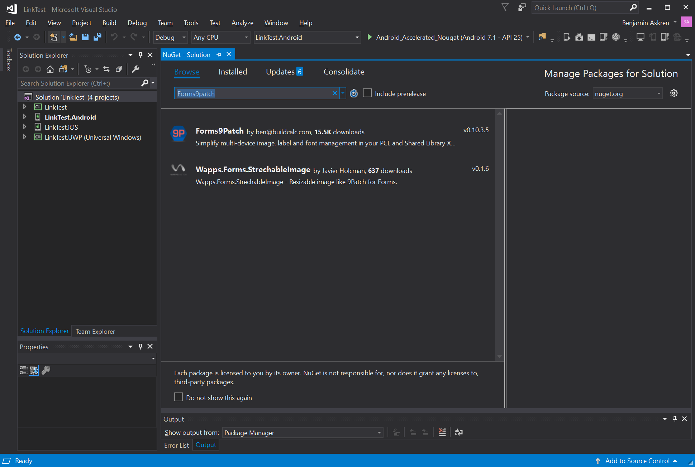

# Getting Started: Windows VisualStudio 2017

Forms9Patch is meant to make it easier to enhance your Xamarin.Forms app. Below is a guide to how to get started.

Before you begin, check out the system requirements to be sure your application and development environment is ready.

## System Requirements

Forms9Patch is an enhancement to Xamarin.Forms.  As such, first be sure you've met the [Xamarin.Forms system requirements](https://developer.xamarin.com/guides/cross-platform/getting_started/requirements/).

Additionally:

- Forms9Patch requires Xamarin.Forms version 2.4.0.280 or newer. 
- To use the <i>`background-color`</i> style attribute within markup text in UWP applications, your UWP applications will need to be built with minimum Windows version of 10.0.16299.0 (Windows 10 Fall Creators Update).

## Build your first Forms9Patch app

This walk through demonstrates how to create an application that displays a label which is marked-up to show a phone number and email link.  Tapping on those links will present a pop-up that asks permission to proceed with the phone call or email.

Create the LinkTest application as follows:

 1. Launch VisualStudio.
 2. Create a new Xamarin Forms project by clicking **File | New | Project** menu item.
 3. In the New Project dialog, browse to **Installed | Visual C# | Cross-Platform**, select the **Mobile App (Xamarin.Forms)** template, set the Name and Solution name to `LinkTest`, assure a suitable location for the project and click the **[OK]** button:

    

 4. In the New Cross Platform App dialog, select the **Blank App** template, select **.Net Standard** Code Sharing Strategy, and then click the **[OK]** button:

    

 5. Add the Forms9Patch Nuget package to each of your solution's projects:  

    - In Solution Explorer, right-click on the LinkTest solution and select Manage NuGet Packages for Solution...:

      

    - ... select the Browse tab ...:

      

    - ... and search for "Forms9Patch":

      

    - Select the Forms9Patch Nuget package:

      

    - Apply it to all of your solution's projects by selecting the check box at the top of the project selection column:

      

    - Be sure the latest stable package is selected and then click [Install]:

      

 6. Initialize Forms9Patch in each of your platform projects:

    **Android:**

    1. Open MainActivity.cs in your solution's Android platform project.
    2. Between ```global::Xamarin.Forms.Forms.Init(this, bundle);``` and ```LoadApplication(new App());```, add the Forms9Patch.Droid initialization call using the key for the LinkTest applications.  The result should look the following:

        ```csharp
            global::Xamarin.Forms.Forms.Init(this, bundle);
            Forms9Patch.Droid.Settings.Initialize(this);
            LoadApplication(new App());
        ```

    **iOS**

    1. Open AppDelegate.cs in your solution's iOS platform project.
    2. Between ```global::Xamarin.Forms.Forms.Init();``` and ```LoadApplication(new App());```, add the Forms9Patch.iOS initialization call using the key for the LinkTest applications.  The result should look like the following:

        ```csharp
            global::Xamarin.Forms.Forms.Init();
            Forms9Patch.iOS.Settings.Initialize(this);
            LoadApplication(new App());
        ```
    **UWP**

    1. Open App.xaml.cs in your solution's UWP platform project.
    2. Find the following line

        ```csharp
                Xamarin.Forms.Forms.Init(e);
        ```

    3. ... and **replace** it with the following lines:

        ```csharp
                Xamarin.Forms.Forms.Init(e, Forms9Patch.UWP.Settings.AssembliesToInclude); 
                Forms9Patch.UWP.Settings.Initialize(this);
        ```

 7. Update your application's MainPage content (MainPage.xaml) to use Forms9Patch elements:
     1. In Solution Explorer, in the LinkTest project, double-click MainPage.xaml to open it:
     2. In MainPage.xaml, update with the following code. This code declaratively defines the user interface for the page:

        ```xml
        <?xml version="1.0" encoding="UTF-8"?>
        <ContentPage xmlns="http://xamarin.com/schemas/2014/forms"
                     xmlns:x="http://schemas.microsoft.com/winfx/2009/xaml"
                     xmlns:Forms9Patch="clr-namespace:Forms9Patch;assembly=Forms9Patch"
                     xmlns:local="clr-namespace:LinkTest"
                     x:Class="LinkTest.MainPage">
            <ContentPage.Padding>
                <OnPlatform x:TypeArguments="Thickness">
                    <On Platform="iOS" Value="20, 40, 20, 20" />
                    <On Platform="Android, WinPhone, Windows" Value="20" />
                </OnPlatform>
            </ContentPage.Padding>
            <StackLayout>
                <Forms9Patch:Label>
                    Example of Forms9Patch markup text.
                </Forms9Patch:Label>
                <BoxView HeightRequest="1" Color="Black"></BoxView>
                <Forms9Patch:Label x:Name="PhoneLabel" >
                    <![CDATA[This is a phone number link: <a id="link1" href="tel:+353015546889">015546889</a> ]]>
                </Forms9Patch:Label>
                <BoxView HeightRequest="1" Color="Black"></BoxView>
                <Forms9Patch:Label x:Name="EmailLabel">
                    <![CDATA[This is an email link: <a id="link2" href="mailto:email@hotmail.com">email@hotmail.com</a> ]]>
                </Forms9Patch:Label>
            </StackLayout>
        </ContentPage>
        ```
 8. Modify your application's MainPage source code (MainPage.xaml.cs) using the following code so it will respond to clicks / taps on the `Forms9Patch.Label` action links.

        ```csharp
        using System;
        using System.Collections.Generic;
        using System.Linq;
        using System.Text;
        using System.Threading.Tasks;

        using Xamarin.Forms;
        using Xamarin.Forms.Xaml;

        namespace Forms9PatchDemo
        {
            //[XamlCompilation(XamlCompilationOptions.Compile)]
            public partial class XamlCDATA : ContentPage
            {
                public XamlCDATA()
                {
                    InitializeComponent();
                    PhoneLabel.ActionTagTapped += ActionTagTapped;
                    EmailLabel.ActionTagTapped += ActionTagTapped;
                }

                private void ActionTagTapped(object sender, Forms9Patch.ActionTagEventArgs e)
                {
                    Forms9Patch.Toast.Create("Link Activated", "The link (id: " + e.Id + ", href:" + e.Href + ") was activated.");
                }
            }
        }
        ```
 9. Now, you're ready to build and run the LinkTest app on a platform.  Since you're developing this app on Windows, how about running LinkTest.UWP?

 - Go to the 


