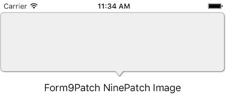

# Using Forms9Patch.Image

`Forms9Patch.Image` extends `Xamarin.Forms.Image` to provide Xamarin.Forms with a patch scalable image element, the ability to tile an image within its alloted bounds, and the rendering of SVG images.  The ImageSource for the `Forms9Patch.Image` element can be specified either as a `Forms9Patch.ImageSource` or a `Xamarin.Forms.ImageSource`. Supported file formats are NinePatch (`.9.png`), `.png`, `.jpg`, `.jpeg`, `.gif`, `.bmp`, `.bmpf`, and `.svg`.

## Background

iOS's UIKit provides `resizableImageWithCapInsets:` to make an UIImage a patch scalable image.  The `capInset` argument is used to specify the regions (distance inset from the edges) which will not scale (or scale in only one direction) when the image is stretched to fill it's parent view.  Similarly, Android provides `NinePatchDrawable` to allow apps to display Nine-patch images as scalable drawing elements.  The Nine-patch image format is used to specify the regions that are allowed to scale when the image is stretched to fill it's parent view.

Both approaches have their advantages.  Unlike iOS's `resizableImageWithCapInsets:`, Android's and Forms9Patch's use of the Nine-patch image format allows for unscalable regions to be anywhere in the image (not just at the edges).  And, because the scaled regions are marked within the image file, scaling can be customized to each file.  On the other hand, `resizableImageWithCapInsets:` provides the ability to define the scaling regions at runtime - which provides additional flexibility and convenience.

Seeing advantages to each approach, `Forms9Patch.Image` allows for both.  If a NinePatch image is provided, `Forms9Patch.Image` uses it's scalable region marking.  If the `CapsInset` property is set, `Forms9Patch.Image` will use it to set the unscalable edges - which means `CapsInset` will always override NinePatch regions.

`## Xamarin.Forms.Image.Aspect vs. Forms9Patch.Image.Fill

`Xamarin.Forms.Image` provides the Aspect property to indicate how an image will fill its bounds.  `Forms9Patch.Image` does not support the `Aspect` property.  Rather, it has the `Fill` property.  The `Fill` property supports the `Aspect` property's `AspectFill`, `AspectFit`, and `Fill` values and adds the `Tile` value for easy management of textures.  See the [Forms9PatchDemo app](https://github.com/baskren/Forms9PatchDemo) for examples of it in action.

## NinePatch image example

Let's describe the use of `Forms9Patch.Image` for NinePatch images through an example.  Say you want to display a pop-up message bubble where the tip is centered.  Because they can have multiple scalable regions, the Nine-patch format works great for this.  Starting with a .png of the bubble, use a NinePatch editor, like Android's `Draw 9-patch` to mark the horizontal and vertical stretchable regions.

| **Before marking** | **After marking** |
|:-:|:-:|
| | |
|`bubble.png` | `bubble.9.png` |
|200x122 | 202x124|

After adding `bubble.9.png` to your cross-platform project as an EmbeddedResource, you can display it using something like the following:

```csharp
var bubbleImage = new Forms9Patch.Image ()
{
    Source = ImageSource.FromResource("MyDemoApp.Resources.bubble.9.png"),
    HeightRequest = 110,
}
var label = new label ()
{
    Text = "Forms9Path NinePatch Image",
    HorizontalOptions = LayoutOptions.Center,
}
```

Resulting in:



## CapsInset Property

### Coding the `CapsInset` Property

The `CapInset` property is used to specify the regions (distance inset from the edges) which will not scale when the image is stretched to fill it's parent view.  For example, let's make the following image a banner by scaling it horizontally.

|  |
|:-:|
| **ResourceID:** MyDemoApp.Resources.Images.redribbon.png |
| **Image Size:** 308x80 |

Load it using `Xamarin.Forms.ImageSource` as the source to `Forms9Patch.Image` and then, set the `CapInsets` property:

```csharp
var label1 = new Label ()
{
    Text = "Xamarin Image",
}
var image1 = new Xamarin.Forms.Image ()
{
    Source = ImageSource.FromResource("MyDemoApp.Resources.Images.redribbon.png"),
}
var label1 = new Label ()
{
    Text = "Forms9Patch Image w/ CapInsets",
}
var image2 = new Forms9Patch.Image ()
{
    Source = ImageSource.FromResource("MyDemoApp.Resources.Images.redribbon.png"),
    CapInsets = new Thickness(23, 0, 110, 0),
}
```

| **iPhone** | **Android** |
|------------|-------------|
|  |  |

### XAML Example

To use `Forms9Patch.Image` in your XAML, you will have to add the `Forms9Patch` namespace (from the `Forms9Patch` assembly) and then use `Forms9Patch.Image` where desired.  Also note that, if you want to use Embedded Resource images, you will need to add an XAML markup extension to the assembly that contains those images (see [Using `Forms9Patch.ImageSource`](ImageSource.md)).  For example:

```XML
<?xml version="1.0" encoding="UTF-8"?>
<ContentPage
    xmlns="http://xamarin.com/schemas/2014/forms"
    xmlns:x="http://schemas.microsoft.com/winfx/2009/xaml"
    xmlns:local="clr-namespace:MyXamlDemo;assembly=MyXamlDemo"
    xmlns:Forms9Patch="clr-namespace:Forms9Patch;assembly=Forms9Patch"
    x:Class="MyXamlDemo.MyPage"
    Padding="5, 20, 5, 5">
    <ScrollView>
        <ScrollView.Content>
            <StackLayout>
                <Label Text="Xamarin.Forms.Image"/>
                <Image Source="{local:ImageMultiResource Forms9PatchDemo.Resources.Images.redribbon}"/>
                <Label Text="Forms9Patch.Image w/ CapInsets"/>
                <Forms9Patch:Image
                    Source="{local:ImageMultiResource Forms9PatchDemo.Resources.Images.redribbon}"
                    CapInsets="23,-1,111,-1"/>
            </StackLayout>
        </ScrollView.Content>
    </ScrollView>
</ContentPage>
```

## Embedded Resource Convenience Constructor

If you do most of your layouts in code (rather than XAML), there are tasks you repeat very often.  And because they are repeated so often, a shorter version
of that task would be convenient.  If you often use `Forms9Patch.ImageSource.FromMultiResource`, `Forms9Patch.ImageSource.FromResource`, or `Xamarin.Forms.ImageSource.FromResource` as the source for your `Forms9Patch.Image` or `Xamarin.Forms.Image`, you will be happy to know that you can instead pass the EmbeddedResourceId as an parameter to the `Forms9Patch.Image` constructor.

```csharp
var image = new Forms9Patch.Image("Forms9PatchDemo.Resources.Images.redribbon");
```

## Fill Property

`Forms9Patch.Image.Fill` property is almost identical to `Xamarin.Forms.Image.Aspect` property.  It is only different in that it uses `Forms9Patch.Fill` instead of `Xamarin.Forms.Aspect` - which means it also supports `Forms9Patch.Fill.Tile` to direct `Forms9Patch.Image` to tile a source image in the image layout.

## TintColor Property

There are times where it is desireable to theme an app at runtime.  One way of doing this is by changing the color of monochrome images (often used as icons). Forms9Patch makes this easy by giving `Forms9Patch.Image` the `TintColor` property.  

```csharp
var image = new Forms9Patch.Image("MyApp.Resource.Printer.png")
{
    TintColor = Color.Blue
};
```

 | Source Image                                        | w/ `TintColor=Color.Blue`                                |
 |-----------------------------------------------------|----------------------------------------------------------|
 |  |  |

**Note:** The `TintColor` property is intented for use with *raster* images that have and makes use of the transparent color plane.  Results will likely be undesirable for other types of raster images.  This property is ignored for vector (`.svg`) images.  

## SourceImageSize Property

Want to be sure you got the image you intended to ask for?  This question can come up when you're doing cross platform development.  The SourceImageSize property can help with this by giving you the size of the ImageSource being used for the image.  

**NOTE:** For NinePatch images (`.9.png`), the value returned **does not** include the two extra pixels in width and height for the NinePatch markup.

## AntiAlias Property

`Xamarin.Forms` relies on the platform image elements to render images.  A small performance improvement can be had by not applying an anti-alias algorithm to the image during rendering.  Just as `Xamarin.Forms`, `Forms9Patch.Image` preforms this anti-alias step by default. However, if you're upscaling an image a bit much and you don't care about some pixalization, then you want a little more performance by setting this property to `true`.

## BackgroundColor Property

What?  Why would an image need a background color?  Well, usually it wouldn't *but* images with transparent regions (`.png` and `.svg`) create an opportunity.  Just as you can use the `TintColor` to theme a monocrome raster image, you can use `BackgroundColor` to them the transparent regions of such an image.  Cool, huh?

| Source image  |  `BackgroundColor=Color.Orange` |
|---------------|---------------------------------------------|
|   |  |

Note the corners are rounded on this image!

## Outline and Shape Properties

Taking things a step further than we did with the BackgroundColor property, why not be able to continue to dress up the image?  Clipping an image to a shape and/or adding a border are two common operations applied to images when they are used as app assets.  Since this is so common, Forms9Patch has them built-in.  To set the shape, use the `ElementShape` property (which takes a `Forms9Patch.ElementShape` value).  Available values are:

| ElementShape     | Description                           | Full Bleed Image Example                                  |
|------------------|---------------------------------------|-----------------------------------------------------------|
| Rectangle        | pretty much the same as "don't clip"  |             |
| Square           | clip the longest side to be the same length as the shortest side    |          |
| Circle           | because, circle clipped head shots are so 2015    |                   |
| Ellipse          | still waiting for this one to be cool |                 |
| Obround          | it's embarrassing how long it took me to  find out there was a name for this shape   |   

And, if you used `Xamarin.Forms.Frame` before, Forms9Patch's Outline properties will seem familiar:

| Property      | Description                                 | Transparent PNG Example                                            |
|---------------|---------------------------------------------|--------------------------------------------------------------------|
| OutlineColor  | Color of Forms9Patch ElementShape's outline |              |
| OutlineWidth  | Width of Forms9Patch ElementShape's outline |              |
| OutlineRadius | Forms9Patch Element's corner radius. Only applies to `Rectangle` and `Square` shapes  |            |

## HasShadow and ShadowInverted Properties

Let's go out on limb and keep adding embelishments to the image.  Once you have the ability to impose a shape to your image, it is common to want a shadow to match the imposed shape.  `HasShadow` makes that happen.  And, going even further, `ShadowInverted` reverses the shadow to give a recessed effect to the shadow.  

Now, here is where Forms9Patch can do something a bit clever.  If the `ImageSource` is a *.png image **with** transparency in the image, the `HasShadow` property of Forms9Patch will impose the shadow on the overlap of the `ElementShape` *and* the non-transparent parts of the image!  NOTE: Setting `ShadowInverted` to true breaks this functionality.
