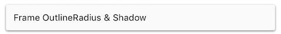
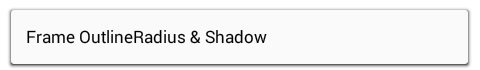

# Using Forms9Patch's Layouts

Just as `Xamarin.Forms.Frame` extends `Xamarin.Forms.ContentView` by adding the `OutlineColor` and `HasShadow` properties, `Forms9Patch.AbsoluteLayout`, `Forms9Patch.Frame`, `Forms9Patch.Grid`, `Forms9Patch.RelativeLayout` and `Forms9Patch.StackLayout` extends their Xamarin.Forms counterparts with those two properties and adds the `BackgroundImage`, `ElementShape`, `OutlineWidth`, `OutlineRadius`, `OutlineColor` and `ShadowInverted` properties.  In other words, everything you can do to decorate a `Forms9Patch.Image`, you can do to decorate Forms9Patch's layouts.

Additionally, the Forms9Patch layouts have the IgnoreChildren property as a way to improve app responsiveness.  When a child element is updated, it kicks off a measurement and layout cycle that can propagate up through the view hierarchy - potentially consuming a lot of CPU.  I'm looking at you, Xamarin.Forms.Android!  Sometimes this is necessary in order to make room for or reclaim room from the updated child element.  However, there a lot of instances where the updated child will never have an impact upon the rest of the view hierarchy - other than slowing everything down while Xamarin Forms goes through the measure-layout cycle.  For example, if you have a Grid with fixed (GridUnitType.Absolute) or proportional (GridUnitType.Star) sized rows and columns then any change to a child will not change the Grid's layout.  So, to keep an update of a child from propagating up the view hierarchy, set the IgnoreChildren property to true.  Please note that this is a "running with scissors" feature that should be used carefully.

## Background Image

### Code Example

Here we are going to create a `Forms9Patch.ContentView`, set a background image, and have a label for `Content`.

```csharp
new Forms9Patch.ContentView
{
    BackgroundImage = new Forms9Patch.Image
    {
        Source = Forms9Patch.ImageSource.FromMultiResource ("Forms9PatchDemo.Resources.redribbon"),
        Fill = Forms9Patch.Fill.Tile,
        CapInsets = new Thickness(30,-1,160,-1),
    },
    Content = new Xamarin.Forms.Label
    {
        Text = "ContentView scalable (CapInsets)",
        TextColor = Color.White,
        FontAttributes = FontAttributes.Bold,
        FontSize = 14,
        HorizontalOptions = LayoutOptions.Center,
        VerticalOptions = LayoutOptions.Center,
    },
    Padding = new Thickness(30,30,110,20),
    HeightRequest = 80,
},
 ```

| iOS  | Android |
|---|---|
|  |  |

### XAML Example

[As discussed earlier](ImageSource.md#xaml-example), using Embedded Resource images in XAML requires the use of a [XAML markup extension](ImageSource.md#xaml-example) in your view's namespace. Assuming such an extension has been setup, the following demonstrates how to use Forms9Patch.ContentView in XAML.

```xml
<?xml version="1.0" encoding="UTF-8"?>
<ContentPage
    xmlns="http://xamarin.com/schemas/2014/forms"
    xmlns:x="http://schemas.microsoft.com/winfx/2009/xaml"
    xmlns:local="clr-namespace:MyXamlDemo;assembly=MyXamlDemo"
    xmlns:Forms9Patch="clr-namespace:Forms9Patch;assembly=Forms9Patch"
    x:Class="MyXamlDemo.MyPage"
    Padding="5, 20, 5, 5">
    <f9p:ContentView Padding="30,30,110,20" HeightRequest="80"/>
        <f9p:ContentView.BackgroundImage>
            <f9p:Image
                Source="{local:ImageMultiResource Forms9PatchDemo.Resources.redribbon}"
                CapInsets="23,-1,111,-1"
                />
        </f9p:ContentView.BackgroundImage>
        <Label Text="Forms9Patch.Image w/ CapInsets"
            TextColor="White"
            HorizontalOptions="Center"
            VerticalOptions="Center"
            FontSize="14"
            />
    </f9p:ContentView>
</ContentPage>
```

## Outline & Shadow

### Outline & Shadow Code Example

```csharp
var frame = new Forms9Patch.Frame {
    Content = new Xamarin.Forms.Label {
        Text = "Frame OutlineRadius & Shadow",
        TextColor = Color.Black,
        FontSize = 12,
    },
    Padding = new Thickness(10),
    Background = Color.FromHex( 12),
    OutlineRadius = 2,
    HasShadow = true,
}
```

| iOS | Android |
|-----|---------|
|  |   |

### Outline & Shadow XAML Example

```xml
<?xml version="1.0" encoding="UTF-8"?>
<ContentPage
    xmlns="http://xamarin.com/schemas/2014/forms"
    xmlns:x="http://schemas.microsoft.com/winfx/2009/xaml"
    xmlns:local="clr-namespace:MyXamlDemo;assembly=MyXamlDemo"
    xmlns:Forms9Patch="clr-namespace:Forms9Patch;assembly=Forms9Patch"
    x:Class="MyXamlDemo.MyPage"
    Padding="5, 20, 5, 5">
    <StackLayout>
        <f9p:Frame
            Padding="20"
            OutlineColor="Blue"
            OutlineWidth="3"
            OutlineRadius="10"
            BackgroundColor="Gray"
            />
            <Label Text="Forms9Patch.Frame w/ OutlineWidth+OutlineRadius"
                TextColor="White"
                HorizontalOptions="Center"
                VerticalOptions="Center"
                FontSize="14"
                />
        </f9p:Frame>
    </StackLayout>
</ContentPage>
```

| iOS | Android |
|-----|---------|
|  |   |
