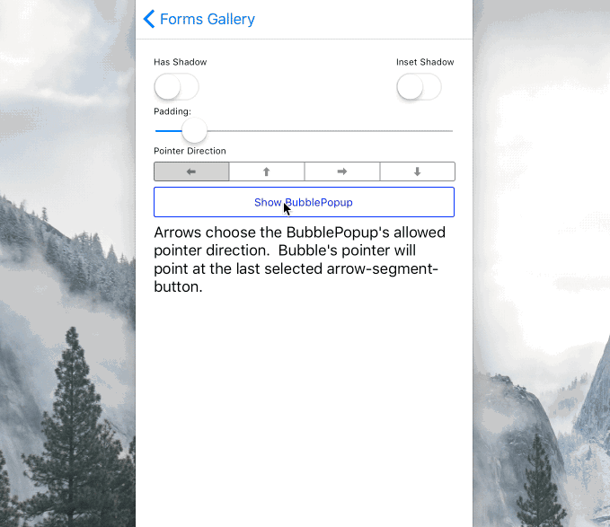
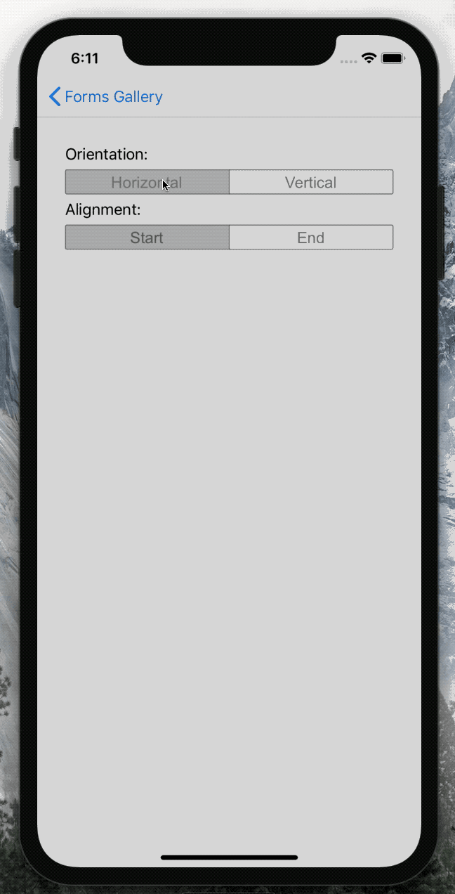

# Forms9Patch Popups

Yet another thing missing from Xamarin Forms is a comprehensive set of popup views.  Forms9Patch has a eight (ModalPopup, BubblePopup, FlyoutPopup, Toast, TargetedToast, PermissionPopup, ActivityIndicatorPopup and TargetedMenu) popups to simplify the most common tasks.  However, this comes at a price!  In previous releases of Forms9Patch, I tried to implement the popups in a way that would require the least amount of prep work on your part.  Unfortunately, this meant a lot very ugly code, performance penalties, and (to add insult to injury) the Android implementation of version 2.3 of Xamarin.Forms broke it for the `Xamarin.Forms.MasterDetailPage`.

As of Forms9Patch version 1.5.0.5,  `Forms9Patch.RootPage` is no longer needed to enable popups **AND** Forms9Patch popups work with pages that have been presented modally.

## Common Properties, Methods and Events

The following properties and methods are common to all Forms9Patch popups, except `ActivityIndicatorPopup`:

### Common Appearance Properties

- `BackgroundImage`: The `Forms9Patch.Image` displayed as the popup's background.
- `BackgroundColor`: popup's optional background color.
- `PopAfter`: the `TimeSpan`, after appearing, at which the popup will pop (disappear) without user interaction.  Popup will not pop itself when `PopAfter` is zero (default) or negative.
- `HasShadow`: one more time ... this actually works on Android.  Has no effect when BackgroundColor has not been set.
- `OutlineColor`: optional outline color.
- `OutlineWidth`: width of optional outline.
- `OutlineRadius`: outline's corner radius.
- `ShadowInverted`: to apply a recessed effect to the layout (if HasShadow is enabled).

### Page Overlay (between the popup and the page the popup sets upon) Properties

- `PageOverlayColor`: The Color of the page overlay upon which the ModalPopup sets.  Default value is `Color.Rgba(0.5, 0.5, 0.5, 0.5)`.
- `CancelOnBackgroundTouch`: Controls is the popup is cancelled if the background is touched.  Default value is true.
- `CancelOnBackButtonTouch`: Controls is the popup is cancelled if the back button (Android only) is touched.  Default value is true.

### Common Memory Management Properties

- `Retain`: a boolean (default: `false`) used to indicate if the popup and its contents should be removed from the view hierarchy as soon as the view is hidden.  Why would I bother to have this? *ANDROID!* If you have a heavy layout that will be shown multiple times, you may not want to re-render each time it is made visible. Seeing `Retain=true` will keep your popup and its content in the view hierarchy so it won't have to be re-rendered the next time you want to present it.

### Common Methods

- `void Cancel()`: Programmatically cancels the Popup.

### Common Events

- `Cancelled`: Called when the popup has been canceled by the user tapping outside its bounds.

## Forms9Patch.ModelPopup

The most needed missing component: a simple content popup that is a content container which centers its contents on the main page.  Since you may want a popup container with a background image, Forms9Patch provides the ModalPopup element for this purpose.  Once you have initialized a Forms9Patch popup view, set the IsVisible property to true to present it.

### Forms9Patch.ModelPopup Unique Properties

- `Content`: The `Xamarin.Forms.VisualElement` that will be the content for the popup view.  Layouts and Views are fair game.
- `ElementShape`: `ElementShape.Rectangle`, `ElementShape.Square`, `ElementShape.Circle`, `ElementShape.Ellipse`, and `ElementShape.Obround`.  Controls the shape of both the border and the background clipping region.

|  |
|---|

## Forms9Patch.BubblePopup

The popup that is missing from both Xamarin.Forms and Android is a pointer bubble popup - a popup that points to another element.  Given a `Target` element, some `Content` to display, and an allowed `PointerDirection`, `Forms9Patch.BubblePopup` will best fit a popup bubble pointing the the `Target`.  Note that, unlike the `ModalPopup` element, `BubblePopup` does not support the `BackgroundImage` nor `ElementShape` properties.  If you do not specify the `Target`, `BubblePopup` will present its content in a `ModalPopup`.  As with `ModalPopup`, once you have initialized a `BubblePopup` you will need to set the `IsVisible` property to `true` to present it.

### Forms9Patch.BubblePopup Unique Properties

- `Content`: The `VisualElement` that will be the content for the popup view.  Layouts and Views are fair game.
- `Target`: The `Xamarin.Forms.VisualElement` to which the bubble popup will point.
- `PointerLength`: how long is the pointer.
- `PointerTipRadius`: what is the radius of the pointer's tip?
- `PointerDirection`: what directions is the bubble popup allow to point?  Type:`PointerDirection`
- `PointerCornerRadius`: what is the radius of the notch between the bubble's body and the pointer?

|  |  |
| --- | --- |

## Forms9Patch.FlyoutPopup

Another popup missing is a flyout - to present content such as menus or master control views.  Give `Forms9Patch.FlyoutPopup` some content to display, set `IsVisible=true` and it will by default have it flyout from the left edge of the current Page.  Change the `Orientation` property to have the flyout come from left/right (`Horizontal`) or top/bottom (`Vertical`).  Change the `Alignment` property to switch between left or right (`Start` or `End`) for `Horizontal` orientation and between top or bottom (`Start` or `End`) for `Vertical` orientation.  Want to be sure the width (for `Horizontal` orientation) is fixed?  Set the `WidthRequest` of your `Content` and it will use that to determine the flyout's width.  Likewise, set the `Content's` `HeightRequest` for `Vertical` flyouts.  

Note that FlyoutPopup also does the hard work of figuring out where the SafeArea is for your content.  You can see that in action in the below GIF.

### Forms9Patch.FlyoutPopup Unique Properties

- `Content`: The `VisualElement` that will be the content for the popup view.  Layouts and Views are fair game.
- `Orientation`: Is the popup going to fly in horizontally or vertically?
- `Alignment`: Is the popup going to be at the left\top (`Start`) or right\bottom (`End`)

|  |
| --- |

## Forms9Patch.Toast

Sometimes you simply need to put a message up on the screen.  Given some HTML formatted text and an HTML formatted title `Toast` will display them in a popup with an (optional but enabled by default) **[OK]** button.  `Toast` is inherited from the `ModalPopup` element so it does support background images.  Unlike `ModalPopup`, `Toast` has the `Create(string title, string text)` static method that will generate and present the toast.  You can still manually construct and present a `Toast` by using its constructor and setting its `IsVisible` property to true.

### Forms9Patch.Toast Unique Properties

- `Title`: The title for the Toast.  See [HTML Markup](Label.md#How-does-Forms9Patch-HTML-Markup-work) for supported markup.
- `Text`: The text for the Toast.  See [HTML Markup](Label.md#How-does-Forms9Patch-HTML-Markup-work) for supported markup.
- `ElementShape`: `ElementShape.Rectangle`, `ElementShape.Square`, `ElementShape.Circle`, `ElementShape.Ellipse`, and `ElementShape.Obround`.  Controls the shape of both the border and the background clipping region.

### Forms9Patch.Toast Unique Methods

- `static Toast Create(string title, string text)`: instantiates and presents a `Toast`.

## Forms9Patch.TargetedToast

Just as `Toast` is a convenience version of `ModalPopup`, `TargetedToast` is a convenience version of `BubblePopup`.  Given a `Target` as a `Xamarin.Forms.VisualElement`, a `Title`, some `Text` to display, and an allowed `PointerDirection`, `Forms9Patch.TargetedToast` will best fit a popup bubble pointing the the `Target`.  Like `BubblePopup` element, `BubblePopup` does not support background images.  If you do not specify the `Target`, it will present itself as a `Toast`.  As with `Toast`, you can use the `Create` static method to instantiate and present a `TargetedToast`.

### Forms9Patch.TargetedToast Unique Properties

- `Title`: The title for the Toast.  See [HTML Markup](Label.md#How-does-Forms9Patch-HTML-Markup-work) for supported markup.
- `Text`: The text for the Toast.  See [HTML Markup](Label.md#How-does-Forms9Patch-HTML-Markup-work) for supported markup.
- `Target`: The `Xamarin.Forms.VisualElement` to which the bubble popup will point.
- `OkButtonColor`: Background color for **[OK]** button.
- `OkTextColor`: Text color for **[OK]** button.
- `OKText`: Text for **[OK]** button.  Set to null to remove the **[OK]** button from the popup.  As noted above, you don't want this set to null when `CancelOnBackgroundTouch` is set to `false`.

### Forms9Patch.TargetedToast Unique Methods

- `static TargetedToast Create(VisualElement target, string title, string text)`: instantiates and presents a `TargetedToast`.

## Forms9Patch.PermissionPopup

Sometimes you simply need to ask a yes/no question.  Given some HTML formatted text and an HTML formatted title, `PermissionPopup` will display them in a popup with **[OK]** and **[Cancel]** buttons.  `PermissionPopup` is inherited from the `ModalPopup` element so it does support background images.  Unlike `ModalPopup`, `PermissionPopup` has the `Create(string title, string text)` static method that will generate and present the toast.  You can still manually construct and present a `PermissionPopup` by using its constructor and setting its `IsVisible` property to `true`.  Unlike `Toast`, the **[OK]** and **[Cancel]** buttons cannot be removed from the layout by setting their text to null.

### Forms9Patch.PermissionPopup Unique Properties

- `Title`: The title for the Toast.  See [HTML Markup](Label.md#How-does-Forms9Patch-HTML-Markup-work) for supported markup.
- `Text`: The text for the Toast.  See [HTML Markup](Label.md#How-does-Forms9Patch-HTML-Markup-work) for supported markup.
- `OkButtonColor`: Background color for **[OK]** button.
- `OkTextColor`: Text color for **[OK]** button.
- `OKText`: Text for **[OK]** button.
- `CancelButtonColor`: Background color for **[Cancel]** button.
- `CancelTextColor`: Text color for **[Cancel]** button.
- `CancelText`: Text for **[Cancel]** button.

### Forms9Patch.PermissionPopup Unique Methods

- `static PermissionPopup Create(string title, string text, string okText = "OK", string cancelText = "Cancel")`: instantiates and presents a `PermissionPopup`.

### Forms9Patch.PermissionPopup Unique Events

- `OkTapped`: Called when the **[OK]** button has been tapped.

## Forms9Patch.TargetedMenu

Sometimes you need a popup menu with a list of menu items.  And, if there are more menu items than available room, the menu needs to have pagination.  `Forms9Patch.TargetedMenu` combines `SegmentedController`'s use of a `List<Segment>` to define the menu items with features of `TargetedToast` to give this functionality.

### Forms9Patch.TargetedMenu Unique Properties

- `Segments`: a `List` of `Forms9Patch.Segment` elements that define the menu items.  See [Forms9Patch.Segment](xref:Forms9Patch.Segment) for how to set a segment's text and icons.
- `FontSize`: size of font to be used.
- `TextColor`: color of text for each menu item.
- `SeparatorColor`: color of separator line between menu items
- `SeparatorWidth`: thickness of separator line between menu items
- `HapticEffect`: if available on platform and enabled via `HapticMode`, what will be the haptic effect: `None`, platform's `KeyClick` effect, platform's `Return` key effect, or platforms `Delete` key effect?
- `HapticMode`: if available on platform, enable, disable, or use default behavior for the haptic effect.

### Forms9Patch.TargetedMenu Unique Events

- `public event SegmentedControlEventHandler SegmentTapped`: fired when a menu item (segment) has been tapped.

## Forms9Patch.ActivityIndicatorPopup

This popup is probably misnamed. Its purpose is to present an activity indicator and block interaction with the app.   Because `ModalPopup` had everything I needed to build this, I named it a popup.  Probably should have thought about that more.  Also, because this is something you typically just want to fire and forget, like `Toast` and `TargetedToast`, `ActivityIndicatorPopup` has a `Create` static method to instantiate and present an instance in one call.

Note that

### Forms9Patch.ActivityIndicatorPopup Properties

- `PageOverlayColor`: The `Color` of the page overlay upon which the `ModalPopup` sets.  Default value is `Color.Rgba(0.5, 0.5, 0.5, 0.5)`.
- `Color`: `Color` of the activity indicator.
- `CancelOnBackgroundTouch`: Controls is the popup is cancelled if the background is touched.  Default value is true.

### Forms9Patch.ActivityIndicatorPopup Methods

- `static ActivityIndicatorPopup Create()`
- `void Cancel()`: Programmatically cancels the popup.

### Forms9Patch.ActivityIndicatorPopup Events

- `Cancelled`: Called when the popup has been canceled by the user tapping outside its bounds.
